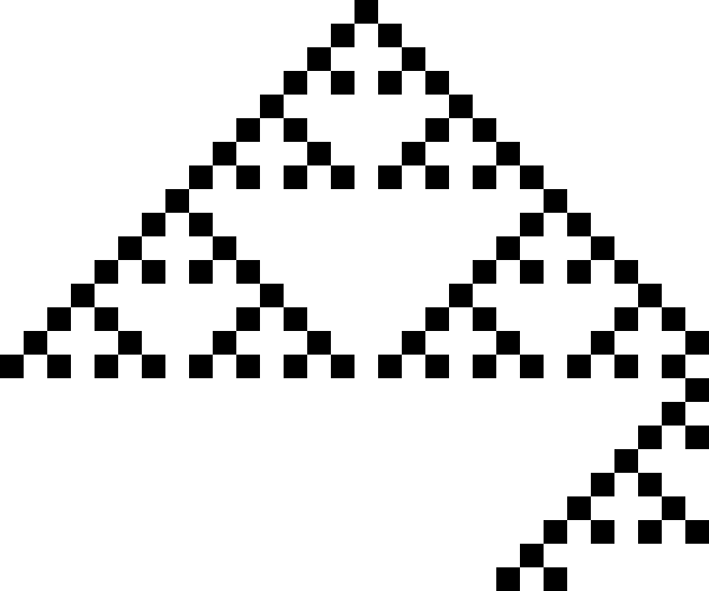

# Cellular Automata

A program for generating cellular automata.



[View in Playground](https://jmank88.github.io/ca/playground/?rule=18)

## Usage

```
> ca --help
Usage of ca:
  -cells int
    	number of cells (default 50)
  -file string
    	output filename
  -format string
    	output format; override file extension; one of: txt, svg, gif, json, png, jpg, jpeg
  -gens int
    	generations (default 50)
  -r int
    	rule (0-255) (default 110)
  -rand
    	randomized initial state
```

See the go generate commands in [example.go](example.go).

## TODO

[ ] Input files (json, etc).

[ ] Fix gif output.
