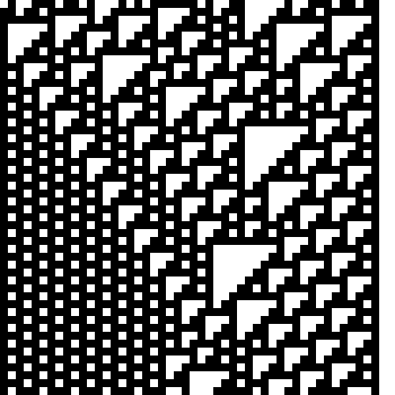

# Cellular Automata

A program for generating cellular automata.



## Usage

```
ca --help
Usage of ca:
  -file string
    	output filename; recognized extensions: txt, svg, gif, json
  -r int
    	rule (0-255) (default 110)
  -rand
    	randomized initial state
```

See the go generate commands in the [examples directory](example/example.go).

## TODO

[ ] Flags for width, generations, cell size

[ ] Input files (json, etc).

[ ] Fix gif output.

[ ] Add other image formats (png, jpg).